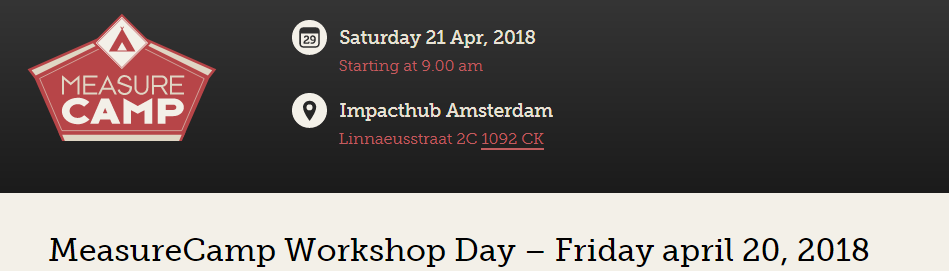
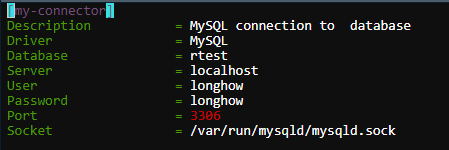

<br>


# The RStudio Environment

---

Start with powerpoint slides over R followed by an intro in RStudio:

* Console,
* Script windows,
* Environment tab (Object browser),
* Packages.


## The R Console

The R Console is a place where you can quickly run a short piece of code. Type in an R expression and Enter to run. Output of scripts also appears in the R Console.


## Scripts 

R Script files are ordinary text files (*.R) with R code. In RStudio you can open and edit multiple scripts. Scripts that belong together can be put in an R Project. Via the File menu> New File> R Script you can create a new R script file in RStudio. Or use the short cut: Ctrl + Shift + N.

In an R script you type code and if you move the cursor on a line you can run that line of code by pressing `Ctrl + Enter`. You can also select multiple lies and run these lines with `Crtl + Enter`. For more options see the Code menu and 'Run Region'.


## R Notebooks / R Markdown files

R notebooks and R Markdown files contain more than just R code, it is a 'complete' document with R code, output and a descriptive storyline. In an R project you can also manage several of these notebooks (or markdown files) and scripts. Note books are created with Rmarkdown, a sort of light weight markup language in which you can specify headers, figures and bold prints, for example. This R course is written in an R markdown file. A notebook / markdown file contains ** R code chunks ** that you can run.


If you press the 'Preview' button above the R notebook you will see a separate window with the **result of the R notebook**. Therefore, RStudio creates a separate file that has the name `<file_name>.nb.html`. This is a html file that you can share with others.
 
Besides the nb.html, you can also "knit" an R notebook / markdown file into an html, pdf or Word document. The header of the markdown document tells how to knit a few things. See for example this document. Next to the 'Preview' button you will see an arrow from which you can choose.


## R Projecten

Organize your R work in projects. A project can consist of different scripts, notebooks, data and output, which you would like to have in one folder. In RStudio you can work very conveniently with different R projects. Through the RStudio interface you can create and manage projects: File> New Project...


## Git version controle

Git is a version control system. In RStudio you can easily use git. You will have to install it first. On Windows you can install git via [the git site] (https://git-scm.com/download/win). We will not discuss this further in this workshop.


## A few simple R expressions to get started

In the code chucnk below you'll find some simple R expressions to get started.

```{r, eval=FALSE}
1 + 1
print("hello world")

## assignment kan je = of <- gebruiken,
## pijltje stamt nog uit een tijd waar het een toets op het toetsenbord was

## Als je onderstaande regel runt wordt het object test gemaakt, je ziet nog verder niks
test = 9

## Om te zien wat er in het object test zit moet je het printen
## Dit doe je door het volgende code te runnen, nu zie je iets verschijnen
print(test)

## Omdat je best vaak snel wilt zien wat er in een object zit volstaat alleen de naam ook
## dus run de volgende regel
test

## als een object al bestaat wordt die zonder waarschuwingen overschreven
test <- 3
test
```


# Data types 

---

All data in R is of a certain type, we will discuss the different data types below. with the `typeof` function you can always request the type of an object in R.

## Numerical data

### Double data type

The `double` datatype in R is often used to represent numerical values, (let's day 'everyday' numbers). For example, in a medical data set, height (1.85) or weight (78.8) of patients.

```{r, eval=FALSE}
x4 = 4
x5 = 5.6 / 8

x6 = pi/2

is.double(x4)
```


### Integer data type

The `integer` data type in R also represent numerical values. In contrast to doubles they represent only natural numbers. For example, a count variable: number of children (0, 1, 2, ... ).


```{r, eval=FALSE}
# let op, onderstaande zijn nog doubles in R.
x = 1
y = 2

is.integer(x)

x = as.integer(1)
z = x + 9.78

is.integer(z)

y = 34L
is.integer(y)

x7 = 4L
is.double(x7)

# in tegenstelling tot sommige andere talen kan je in R double en integers 
# in berekeningen zonder vertalingen gebruiken

x8 = x4 + x7
typeof(x8)
```

## Character data type

In R you can use the `character` data type to work with texts (text data), or often also called strings. Operations and manipulations of characters are explained later on in this workshop.


```{r, eval=FALSE}
x1 = "Longhow Lam"
x2 = "1628 AA Hoorn"

is.character(x1)

nchar(x2)

x3 = paste(x1, x2)
x3 = paste(x1, x2, sep="")
```


## Factor data type

In R, `factors` are meant to represent categorical variables. For example, gender, or education. Do not confuse a factor with the character type, you can create factor variables from character variables. In some predictive modeling functions you explicitly need factor variables and not character.

Consumer data sets may include names or surnames of persons of the type character, but for example the gender or education are often of the type of factor.


```{r, eval=FALSE}
x3 = c("M", "F", "M")

is.character(x3)
typeof(x3)

y3 = as.factor(x3)
x3
y3
```


## Logical data type

If you run a test in R, then the result is of the type `logical`. We already saw the functions `is.double` and` is.integer`, which returned an object of type logical.


```{r, eval=FALSE}
x7 = TRUE
x8 = FALSE

typeof(x7)

# test if an object is smaller than a value
x9 = x6 < 8

is.logical(x9)

x1 = as.integer(1)
x2 = 1

x1
x2
```

Note that in R, you can test if a double object is equal to an integer object, in other some languages this is not possible.

```{r, eval = FALSE}
is.integer(x2)
is.integer(x1)

x1 == x2
```

The next block of code shows logical operators.

```{r, eval=FALSE}
# ampersand is testen op "DIT"" EN "DAT""
TRUE & FALSE    # AND

x = 9
x < 10 & x > 5

# negatie, tegenovergestelde
!TRUE           # NOT
!FALSE

# vertical pipe is testen op "dit"" OF "dat""
TRUE | FALSE    # OR
x < 7 | x > 8
```

In R you can use logicals in calculations.

```{r, eval = FALSE}
TRUE + TRUE
FALSE + FALSE + TRUE

x = rnorm(10000)
sum(x>2)
```


What the F... is this?  Do you know why this is happening?

```{r, eval = FALSE}
0.1 + 0.2 == 0.3

1 + 2 == 3
x = 0.3

sprintf("%.16f", x)
sprintf("%.24f", x)
```


## Missing values

Missing values can be represented in R with `NA`. You can have missing doubles, integers, etc.

```{r, eval=FALSE}
x3 = NA

# gebruik is.na om te checken of iets NA is
is.na(x3)

# een rijtje getallen waarbij eentje missend is
x4 = c(1, 2, 3, 4, NA, 5, 7)

# hoeveel elementen zijn NA en niet NA
sum(is.na(x4))
sum(!is.na(x4))

x4 < 4

is.na(x4)
```


# Data structures

---

Data in R can appear in different forms, the so-called data structures. We will discuss a number of basic structures below.


## Vectors

Vectors are used to store a 'row' of elements. You can have a vector of doubles, characters etc ... All elements can only be of the same type!


```{r, eval=FALSE}
## een getal is ook al een vector, van lengte 1
x0 = 1

x1 = c( 1, 2, 3, 4, 5)
length(x1)
class(x1)

x2 = c(2L, 3)
typeof(x2)

x3 = c("p", 2)
```

There are several functions in R that you can use to generate vectors without typing all the elements one by one :-)


```{r, eval = FALSE}
x1 = 1:1000
x1 = 187:278

x2 = seq(1, 50, length=100)
x2a = seq(1,500, by = 20)

## samenvoegen van twee of meer vectoren
x3 = c( x0, rnorm(100))

class(x4)
```

Generating some random numbers is useful for quickly having some data to test, in R there are various functions.

```{r, eval=FALSE}
# normaal verdeelde getallen
rnorm(100)
rnorm(100, 9, 2)

#uniform verdeelde getallen
runif(100)
runif(100,8,10)

# trekken uit een vector
x4 = sample( letters, rep = TRUE, size = 100)
```


Calculations on vectors take place on element level by default.

```{r, eval=FALSE}
y = 3 * x3 + 8

## en wat is dit???
y = x4 + 8

x4 = rep(1:6, 7)
x4 = rep(x4,8)

x5 = rep(1:10, each = 3)
```

The `cut` function to make factor vectors from double vectors.

```{r}
x <- rnorm(100)
y <- cut(x, 4)
```


### Subscripting of vectors

How do you approach elements in a vector? That is possible with subscripts.

```{r, eval=FALSE}
## R begint te tellen bij 1
x3 = 100:200

## subscripts zijn : 1 getal, een vector van getallen, negatieve getallen
x3[1]
x3[  4:10  ]
x3[  -(1:10)]

## gebroken kan ook...
x3[8.9]

## je kan met subscripts ook elementen veranderen
x3[  8:17  ] = 0
```

You can also specify a vector of TRUE / FALSE as a subscript.

```{r, eval=FALSE}
x = rnorm(100)
x[x > 2]

```

A few simple functions that you can apply to vectors

```{r, eval=FALSE}
y = rnorm(1000)

mean(y)
var(y ) 
min(y)
sd(y)
max(y)
summary(y)

sum(y < 0)
```


##  Matrices

A matrix is a collection of vectors that are of the same length. You can have rectangular matrices (number of rows smaller or larger than number of columns) or you can have square matrices (number of rows = number of columns).


```{r, eval=FALSE}
## maak een matrix van een vector
m1 = rnorm(100)
m2 = matrix(m1, byrow = FALSE, ncol=10)
m2
dim(m2)
class(m2)

## maak een matrix van een aantal vectoren
x = 1:10
y = 10:1
z = 11:20

m3 = cbind(x,y,z)
m4 = rbind(x,y,z)
```

Just like vectors you can access elements in a matrix with subscripts, below are a few examples.

```{r, eval = FALSE} 
m2[1,5]

m2[  4:10,    3:5]

m2[5,]

m2[ ,5]
```

If you have matrices in R you can perform mathematical (linear algebra) calculation on them. A few examples: determinant, transpose and inverse.

```{r, eval =FALSE}
# determinant van een matrix
det(m2)

# matrix transponeren
t(m2)

# inverse van een matrix
solve(m2)

# er zijn twee soorten vermenigvuldigingen van matrices
m2 %*% solve(m2)
m2 * solve(m2)

round(m2 %*% solve(m2))
```

## Data frames

A data frame can be seen as a matrix, but unlike a matrix, columns of a data frame can be of a different data type. For data analysis with 'real' data, a data frame will be the most useful structure. For example, you have a factor column 'Gender', double columns with 'Age' and 'Income' and you can have a character column with 'surname'.


```{r, eval=FALSE}
x1 = 1:100
x2 = rnorm(100)
x3 = rnorm(100)
x4 = sample(c("M","F"), size = 100, replace = TRUE)

df1 = data.frame(
  kolomnaampj1 = x1,
  income = x2,
  age = x3,
  type = x4
)

# laat eerste 10 rijen zien
head(df1,10)
```

The following functions can be used to show some extra information from a data frame.

```{r, eval=FALSE}
# laat de namen van de kolommen zien
names(df1)

# names kan je ook gebruiken om bestaande kolomnamen te wijzigen
df2 = df1
names(df2) = c("A", "B", "C", "D")

# dimensie en classe
dim(df1)
class(df1)

# De levels van kolom 'type' uit mydf
levels(mydf$type)

### pas op met characters die worden standaard in data.frame naar factors omgezet
x4
class(x4)
class(df1$type)

mydf = data.frame(kolomnaampj1 = x1, income = x2, age=x3, type = x4, stringsAsFactors = FALSE)
mydf
class(mydf$type)

## Dit is ook in de Environment viewer te zien
```


Just like with matrices, you can use subscripts in data frames to extract certain parts from a data frame.

```{r, eval=FALSE}
df1[1,3]
df1[11:20,]

df1[, 2:3]
df1$income

## kolom toevoegen
df1$NEW = df1$income / 100
df1
```


# Importing data

---

## The 'Import Dataset' gui

## Import functions

Als je met R werkt heb je natuurlijk data nodig, zoals we op bovenstaande manier data hebben gemaakt zal het in de praktijk niet gebeuren met echte data sets. Die leven in data bases of in files

Er zijn een aantal packages die handig zijn om files in te lezen.

* `readr` package, voor tekst files
* `haven` package voor files van SAS, SPSS, Stata
* `readxl` voor Excel files

R heeft ook standaard functies voor het inzegen van text files, maar ik gebruik vaak de functies uit het package `readr`. Voor grote files is het veel sneller. En je ziet dan ook een progress bar. In RStudio, kan je de import functies ook aanroepen via de ** Import Dataset ** GUI die het inlezen van data begeleidt.


```{r, eval=FALSE}
### data met restaurants in Nederland
library(readr)
Restaurants = read_csv("data/Restaurants.csv")

### Excel files inlezen
library(readxl)
test = read_excel(
  "data/test.xlsx",
  range = "D8:F14"
)
```

## RDS files

Je kan R objecten (niet alleen data frames) weg schrijven met de `saveRDS` functie, en deze kunnen weer ingelezen worden met de `readRDS` functie. files die je krijgt zijn binaire bestanden, ze kleiner dan tekst files en zijn sneller om weer in R in te lezen.

```{r, eval = FALSE}

```

## Database connection

In R you can connect to external databases, like MySQL, Apache HIVE or SQL Server. You can use odbc, and on Linux there is config file to specify the connection to the specific database. An example is given below where an odbc connection is used to connect to a MySQl database server.



Now that there connection named `my-connector` we can use that in R to connect.

```{r, eval = FALSE}
library(odbc)
library(DBI)
library(dplyr)
con_sql <- dbConnect(odbc::odbc(), "my-connector")
cars = tbl(con_sql, "mtcars")

```


In the RStudio GUI you can see (only for certain connectiions) the data tables in the data base server.


For more details on connectring R rto a database see [this website](https://db.rstudio.com/overview).

---

# Data preparation and Manipulation

---

## De dplyr library

---

Dit package / library is ontzettend handig om data te bewerken in R. De syntax is elegant en dplyr code kan je in sommige gevallen ook gebruiken voor data die niet in R zit. Bijvoorbeeld, data in Spark kan je met dplyr code bewerken. Er zijn veel 'sleutel' woorden, maar de belangrijkste zijn `select`,  `filter`, `mutate`, `arrange`, `summarize`, `slice` en `rename`. 

Het mooie is dat deze sleutel woorden ook achter elkaar gebruikt kunnen worden met de `%>%` chain operator. We gebruiken als voorbeeld data uit de datasets library. `mtcars` is een klein data set met wat auto gegevens en `iris` is de bekende data set met drie soorten bloemen.


### kolommen selecteren met select

```{r, eval=FALSE}
## enkele kolommen selecteren
my.cars = select(mtcars, hp, mpg, drat)

## via de chain operator, dit is niet alleen handig maar zo kan je verschillende operaties achter elkaar plakken.
my.cars = mtcars %>% 
  select(
    hp, 
    mpg,
    drat
  )

## meerdere kolommen selecteren
test1 = iris %>% 
  select(
    starts_with("Petal")
  )

## bepaalde kolommen selecteren
test2 = mtcars %>% 
  select(
    contains("pg"),
    starts_with("c")
  )

my.cars = mtcars %>% .[2:6]
```

### kolom maken of wijzigen met mutate

We zagen al dat je kolommen in een data frame kon maken of wijzigen met `$` 

```{r, eval=FALSE}
my.cars$kolom2  = rnorm(32)
my.cars$kolom3  = my.cars$kolom2 + 9
```

Maar met `mutate` kan je dit veel eleganter doen

```{r, eval=FALSE}
mycars = mtcars %>%
  select(
    disp, 
    mpg 
  ) %>%
  mutate(
    displ_l = disp / 61.0237,
    tmp = mpg *1000
  )
```

Je kan nieuwe kolommen maken die afhankelijk zijn van kolommen die je net in mutate maakt

```{r, eval=FALSE}
mycars = mtcars %>%
  mutate(
    displ_l = disp / 61.0237,
    tmp = mpg *1000,
    tmp2 = tmp + 1
  )
```


### distinct rows

Soms wil je data ontdubbelen, dit kan je in R doen met de functie `distinct`

```{r, eval=FALSE}
distinct( select(mtcars, carb, gear))

distinct(select(mtcars, 10,11))

### pipe / chain operatie
myset = mtcars %>% 
  select(10,11) %>%
  distinct
```


### data sets filteren

Met `filter` en `slice` kan je rijen uit een data frame halen. 

```{r, eval=FALSE, include=FALSE}
filter(
  mtcars, 
  cyl == 8 & gear > 3
)

## meerdere filter expressie bekenen EN

filter(
  mtcars, 
  cyl == 8,
  gear > 3
)

## als je of wilt moet je | gebruiken

filter(
  mtcars, 
  cyl == 8 | gear > 3
)
```

Met `slice` kan je op basis van row numbers data selecteren. Als voorbeeld, de eerste 8 records, of record 8 tot en met de laatste record.

```{r, eval=FALSE}
slice(mtcars, 1:8)
slice(mtcars, 8:n())
```

### data sets aggregeren

Aggregeren met de functie `group_by` en `summarise` deze gaan vaak hand in hand samen.

```{r, eval=FALSE}
## apart aanroep van group_by en summarise... zo kan je zien wat group_by oplevert
by_cyl = group_by(mtcars, cyl) 
class(by_cyl)

summarise(by_cyl, Naampje1 = mean(disp), Naampje2 = mean(hp))


## maar vaak doe je de twee in 1 run samen
out = mtcars %>%
  group_by(
    cyl
  ) %>% 
  summarise(
    mdisp = mean(disp),
    mhp = mean(hp)
  )


out = filter(
  mtcars, mpg > 11
  ) %>%
  group_by(
    cyl, 
    carb
  ) %>% 
  summarise(
    N = n(), 
    MeanDisp = mean(disp),
    SD_HP = sd(hp)
  )
```


### data sets joins

Met dplyr kun je makkelijk tabellen joinen. Er zijn verschillende joins die ondersteunt worden. We geven hier een aantal voorbeelden.


```{r, eval=FALSE}
### maak twee data frames aan
df1 = data.frame(
  col1 = c(1,2,3,4,5), tt = rnorm(5)
)

df2 = data.frame(
  col1 = c(3,4,5,6,7), xx = rnorm(5), zz = runif(5)
)

## selecteer rijen die zowel in df1 en df2 zitten 
df3 = inner_join(
  df1, 
  df2,
  by = c("col1" = "col1")
)

## alle rijen die in df1 zitten, geen match levert NA op
df4 = left_join(
  df1,
  df2,
  by = c("col1" = "col1")
)

## alle rijen die in df2 zitten
df5 = df1 %>% right_join(
  df2,
  by = c("col1" = "col1")
)

## alleen de rijen van df1 die niet in df 2 zitten
df6 = df1 %>% anti_join(
  df2,
  by = c("col1" = "col1")
)

## alle rijen van df1 en df2
full_join(df1, df2, by = c("col1" = "col1"))
```


<br>

## Data frames stapelen of plakken

Soms wil je twee tabellen op elkaar stappelen tot een nieuwe tabel, dat kan je doen met `bind_rows`. Als je twee tabellen naast elkaar wilt zetten tot een nieuwe tabel, gebruik dan `bind_rows`.

```{r, eval=FALSE}
## bind_rows
A = data.frame(x=1:5, y = rnorm(5))
B = data.frame(x=11:15, y = rnorm(5))
C = bind_rows(A,B)

## kolommen die niet in een van de data frames zitten worden aangevuld
E = data.frame(x=21:25, y = rnorm(5), z = rnorm(5))

bind_rows(A,E)
```

```{r, eval=FALSE}
A = data.frame(x=1:5, y = rnorm(5))
B = data.frame(q=11:15, q = rnorm(5))
bind_cols(A,B)

## als een van de data frames meer rijen heeft, dan wordt er NIET aangevuld
A = data.frame(x=1:5, y = rnorm(5))
B = data.frame(q=11:17, q = rnorm(7))
bind_cols(A,B)
```

<br>

## Tidy data en wide data

---

Tidy data is wanneer data in de volgende vorm zit:

* Elke variabele is in een kolom.
* Elke observatie is een rij.
* Elke waarde is een cel.

Stel we hebben de volgende data set

```{r, eval=FALSE}
library(tidyr)
stocks <- data.frame(
  time = as.Date('2009-01-01') + 0:9,
  X = rnorm(10, 0, 1),
  Y = rnorm(10, 0, 2),
  Z = rnorm(10, 0, 4)
)
stocks
```

Soms is het handig om data waarden in 1 kolom te hebben en een aparte variabele die de variabele weergeeft

```{r, eval=FALSE}
stocksm <- stocks %>% gather(stock, price, -time)
stocksm
```

en spread is het omgekeerde proces

```{r, eval=FALSE}
stock2 = stocksm %>% spread(stock, price)
stock2
 
## als er niet even veel observaties zijn?

test = data.frame(
  T = c(1,2,3,1,2), 
  V = c("A","A","A","B","B"),
  price = c(4,5,6,7,8)
)

test2 = test %>% spread(V,price)
test2
```

Een handige functie in tidyr is `separate`, dit kan je gebruiken om een kolom uit elkaar te trekken. Standaard worden niet alpha numerieke tekens als separator gebruikt.

```{r, eval=FALSE}
df = tibble(x = c("A.B", "C.P", "P.Q"))
df %>% separate(x, c("Kol1", "Kol2"))

## Er kunnen tw weinig of teveel kolommen zijn.
df = tibble(x = c("A.B", "C.P", "P.Q", "pp", "P.2.4"))
df %>% separate(x, c("Kol1", "Kol2"))


df = tibble(x = c("A.B", "C.P", "P.Q", "pp", "P.2.4"))
df %>% separate(x, c("Kol1", "Kol2", "Kol3"))
```

<br>


## Character data bewerken met stringr

---

Character data in R kan je bewerken/manipuleren met het `stringr` package. Voordat we daar verder op in gaan is het handig om te weten wat reguliere expressies zijn.

### Reguliere expressies

Dit is een soort 'mini' taaltje om character patronen te specificeren om er vervolgens bijvoorbeeld op te zoeken. Eerst wat dummy character data.

```{r, eval=FALSE}
test = c("Mijn nummer is 06-12345678", "dit is .. een 1628EP postcode test", "foutje?:  0234XD", "dit is er nog een 1628 EP", "en nog een foute 126EP", "nog een 1234    XX", "1234eZ en nog 4567PK", "12345 Aabcde", "&yfy.")
test
```

Een paar voorbeelden van reguliere expressies.

```{r, eval=FALSE}
library(stringr)

## een digit, en precies 1 digit
patroon = "\\d"
str_extract(test, patroon)

## 1 of meerdere digits
patroon = "\\d+"
str_extract(test, patroon)

## precies twee letters
patroon ="[[:alpha:]]{2}"
str_extract(test, patroon)

## Een postcode
patroon = "\\d{4}\\s?[[:alpha:]]{2}"
str_extract(test, patroon)

## Maar een postcode begint niet met een 0
patroon = "[1-9]\\d{3}\\s?[[:alpha:]]{2}"
str_extract(test, patroon)

## special punctuation characters !"#$%&’()*+,-./:;<=>?@[]^_`{|}~
patroon = "[[:punct:]]"
str_extract(test, patroon)
```

Sommige mensen zijn de wildcard notatie gewend om te zoeken in strings, deze wildcard notatie kan je vertalen naar reguliere expressies met `glob2rx`. Een paar voorbeelden zullen hieronder geven. 

```{r, eval=FALSE}
patroon = glob2rx("*23*")
str_extract(test, patroon)
```

Voor een cheatsheet over reguliere expressies zie [regex cheatsheet](https://www.rstudio.com/wp-content/uploads/2016/09/RegExCheatsheet.pdf)


## Dates and times in R

---

Voor datums (en tijden) in R zijn de packages `anytime` en `lubridate` heel handig. Laten we er van uitgaan dat we characters hebben met datums en daar mee willen rekenen. Dan kunnen we de functie `anydate` uit het anytime package gebruiken of een van de `ymd` functies.

```{r, eval=FALSE}
library(lubridate)
library(anytime)

y = c("1973-09-12", "1980-05-23", "1981-12-09")

testdata = tibble(DoB = y)

testdata = testdata %>%
  mutate(
    GeboorteDatum = anydate(DoB),
    GeboorteDatum2 = ymd(DoB)
  )
```

De functie `anydate` parsed diverse character notatie naar een date kolom, de gaat meestal goed :-)

```{r, eval=FALSE}
y = c("1973/09/12", "05/23/1980", "23/05/1980","1981-12-09")

testdata = tibble(DoB = y)

testdata = testdata %>%
  mutate(
    GeboorteDatum = anydate(DoB)
  )
```

Nu we een datum echt als date column in een data frame of tibble hebben kunnen we er mee rekenen.

```{r, eval=FALSE}
testdata = testdata %>%
  mutate(
    leeftijd = today() - GeboorteDatum,
    leeftijd2 = as.numeric(today() - GeboorteDatum)/365,
    dag = wday(GeboorteDatum, label=TRUE)
  )
```

*UNIX time stamps*....  Wat zeg je?

Een Unix time stamps is het aantal seconden sinds 1-1-1970. Mocht je dit ooit tegen komen dan kan anytime er ook mee uit de voeten.

```{r, eval=FALSE}
tmp = read_csv("data/unixtimestamps.csv")
tmp$datum = anydate(tmp$timestamp)
tmp
```


Tijdstippen kunnen in R ook worden weergegven met times


```{r, eval=FALSE}
tmp = paste("2018-01-23", c("12:01:33", "12:01:38", "12:01:58"))
Waarde = c(2.4, 5.6, 7.8)

MeetData = tibble(tmp = tmp, Waarde= Waarde)

MeetData = MeetData %>% 
  mutate(
    Meettijdstip = ymd_hms(tmp)
  )

```


### durations en intervals

Als je in R twee datums/times van elkaar aftrekt krijg je in R een duration 

```{r, eval=FALSE}
MeetData = MeetData %>% 
  mutate(
    duur = ymd_hms("2018-02-01 00:00:00") - ymd_hms(tmp)
  )

```

Ja kan durations ook zelf maken en optellen bij een datum

```{r, eval=FALSE}
testduur = dweeks(3)
testduur = dweeks(3.1)
class(testduur)

MeetData = MeetData %>% 
  mutate(
   t2 = Meettijdstip + dyears(2),
   t3 = Meettijdstip + dseconds(1800),
   t4 = Meettijdstip + dweeks(3)
   
  )

```


In R heb je ook zogenaamde `interval` objecten, dit is de tijdsperiode tussen een start en eind datum. Hiermee kan je de leeftijd in jaren ook precies uitrekenen.

```{r, eval=FALSE}

y = c("1973-09-12", "1973-01-09")

testdata = tibble(DoB = y)

testdata = testdata %>%
  mutate(
    GeboorteDatum = anydate(DoB),
    interval1 = interval(GeboorteDatum, today()),
    interval2 = GeboorteDatum %--% today(),
    leeftijd = interval1 %/% years(1)
  )

testdata

# NB %/% is de integer division in R
13 / 6
13 %/% 6
```


# Data visualisation

---

## ggplot

## plotly

## leaflet

## visnetwork

restaurant edges


# Machine learning

---

In R you can create different machine learning models, in this script I wlll demo supervised machine learning:

* regression, with lm
* classification, with glm, rpart and h2o

In supervised learning you are predicting an observed 'Target', observed 'behaviour' from data. When this target is binary we have a classifiaction problem. For example we observed whether or not customers responded to a mailing, whether or not a customer had a car accident. When this target is numeric we have a regression problem. 


I'll also show market basket analaysis with the package `arules`. A technique to o analyse transactional data. For example physical purchases in suprmarket or web clicks on a site.


## Lineare regressie 

We beginnen met simpele lineaire regressie, bruikbaar voor voorspel modellen waar de Target variable continu (numeric) is. We nemen als voorbeeld huizen prijs data die ik gescraped heb van jaap.nl. We willen de prijs van een huis voorspellen basis van een aantal input variabelen/kenmerken.

```{r, eval = FALSE}
jaap = readRDS("Jaap.RDs")

modelout  = lm( prijs ~ kamers               , data = jaap)
modelout2 = lm( prijs ~ kamers + Oppervlakte , data = jaap) 

modelout
modelout2
```

Modeling functies in R retourneren objecten met van alles er nog wat in. De functie `lm` levert een object af van de klasse lm.

```{r, eval = FALSE}
class(modelout)
names(modelout)
modelout$coefficients

summary(modelout)
plot(modelout)
```

Je ziet dat er wat outliers in de data zitten, die kunnen we nog eens er uit filteren

```{r, eval=FALSE}
library(dplyr)
jaap = jaap %>% filter( prijs < 2000000 )
modelout  = lm( prijs ~ kamers               , data = jaap)
modelout2 = lm( prijs ~ kamers + Oppervlakte , data = jaap) 
```

Iets mooiere diagnostische plots uit `lm` objecten krijg je met de library `ggfortify` die weet hoe je lm objecten moet interpreteren voor ggplot. Dan kan je met de functie `autoplot` uit ggplot mooiere diagnostische plots maken.

```{r, eval = FALSE}
library(ggfortify)
library(ggplot2)

ggplot2::autoplot(modelout)
```

### formula objects

Modellen in R kan je specificeren met zogenaamde de formula objects. Hieronder zie je een aantal voorbeelden.

```{r, eval = FALSE}
jaap = jaap %>% mutate(PC1Positie = stringr::str_sub(PC,1,1))

f0 = prijs ~ Oppervlakte + kamers 
m0 = lm(f0, data = jaap)
summary(m0)

f1 = prijs ~ Oppervlakte + kamers + PC1Positie
m1 = lm(f1, data = jaap)
summary(m1)

## interactie termen
f2 = prijs ~ Oppervlakte + kamers + PC1Positie + Oppervlakte*PC1Positie
m2 = lm(f2, data = jaap)
summary(m2)

## interactie termen
f3 = prijs ~ Oppervlakte + kamers + PC1Positie + Oppervlakte*PC1Positie +  Oppervlakte*kamers
m3 = lm(f3, data = jaap)
summary(m3)

##  interactietermen
f4 = prijs ~ Oppervlakte*kamers*PC1Positie 
m4 = lm(f4, data = jaap)
summary(m4)
```


Als je verschillende model objecten hebt gemaakt kan je de functie `anova` gebruiken om ze met elkaar te vergelijken. Dit gebeurt met behulp van F statistics. De modellen moeten wel oplopend in complexiteit zijn.


```{r, eval =FALSE}
anova(m0, m1, m2, m3, m4)
```


```{r, eval=FALSE}
##  termen weglaten
f5 = prijs ~ Oppervlakte*kamers*PC1Positie - Oppervlakte:kamers:PC1Positie
m5 = lm(f5, data = jaap)
summary(m5)

## een target en de rest van de variabelen als inputs
f6 = prijs ~ . -PC6 -PC
m6 = lm(f6, data = jaap)
summary(m6)
```


### Buckets / linear constant  en splines 

Als een input variable niet linear is m.b.t. de target kan je deze niet lineariteit modelleren met buckets (linear constante stukken) of met splines.

```{r, eval = FALSE}
library(ggplot2)
library(dplyr)
library(splines)

jaap %>% filter(prijs < 1000000, Oppervlakte < 1500) %>%ggplot(aes(x=Oppervlakte, y= prijs)) + geom_point()

mybreaks = seq(0,1000, by = 25)
jaap = jaap %>% mutate(OppervlakteBucket = cut(Oppervlakte, breaks = mybreaks))


m1 = lm(prijs ~ Oppervlakte, data = jaap)
m2 = lm(prijs ~ OppervlakteBucket, data = jaap)
m3 = lm(prijs ~ ns(Oppervlakte,6), data = jaap)

summary(m1)
summary(m2)
summary(m3)

```

###  predicties

Met de functie `predict` kunnen we nieuwe huizen scoren, dat wil zeggen de prijs van andere huizen die niet in de training data set zaten voorspellen.


```{r, eval=FALSE}
NieuweHuizen = data.frame(
  Oppervlakte = seq(20, 250, l = 100)
  ) %>%
  mutate(
   OppervlakteBucket = cut(Oppervlakte, breaks = mybreaks)
  )

# Bucket predicties
prijs2 = predict(m2, newdata = NieuweHuizen)
NieuweHuizen$prijs2 = prijs2

ggplot(NieuweHuizen, aes(x=Oppervlakte, y = prijs2)) + geom_line()

# Spline predicties
prijs3 = predict(m3, newdata = NieuweHuizen)
NieuweHuizen$prijs3 = prijs3


ggplot(NieuweHuizen, aes(x=Oppervlakte, y = prijs2)) + geom_point() + geom_point(aes(y=prijs3), col=2)

```


## Classification

We use insurance data from the library `insuranceData` to demonstrate classification models. This data set is based on anonymized one-year vehicle insurance policies taken out in 2004 or 2005. There are 67856 policies, of
which 4624 (6.8%) had at least one claim. 

Variables:

* veh_value	vehicle value, in $10,000s
* exposure	0-1
* clm		occurrence of claim (0 = no, 1 = yes)
* numclaims	number of claims
* claimcst0	claim amount (0 if no claim)
* veh_body	vehicle body, for example hatchback, minivan etc.
* veh_age	age of vehicle: 1 (youngest), 2, 3, 4
* gender		gender of driver: M, F
* area		driver's area of residence: A, B, C, D, E, F
* agecat		driver's age category: 1 (youngest), 2, 3, 4, 5, 6

```{r, eval=FALSE}
### libraries needed
library(insuranceData)
library(yardstick)
library(rpart)
library(visNetwork)
library(h2o)
library(rsample)
library(dplyr)

data("dataCar")
```

The target should be a factor variable when doing classification

```{r}
dataCar = dataCar %>%
  mutate(
    Target = as.factor(clm)
  )
```


### split data set

```{r, eval=FALSE}
TT = rsample::initial_split(dataCar)
trainData = training(TT)
testData = testing(TT)
```


### Logistic regression

A logistic regression can be seen as a generalisation of the linear regression model. It is a linear regression model in the *log odds*. When you plot a binairy target against an input variable, it is often hard to see a relation. Use a smoothing plot.

```{r, eval=FALSE}
library(ggplot2)
ggplot(trainData, aes(x=exposure,y=clm)) + geom_point()
ggplot(trainData, aes(x=exposure,y=clm)) + geom_smooth()
```


We can use the function `glm` in R to fit / train logistic regression models in R.

```{r, eval = FALSE}
cars_glm = glm(
  Target ~ veh_value + exposure + gender + veh_body + area + veh_age,
  data = trainData,
  family = binomial
)

summary(cars_glm)
```

Interpretation of the coefficient $c$ for a variable $x$ is as follows. One unit increase in the variable $x$ means $\exp(c)$ more likely that you will claim. So positive coefficient values mean increase of claim probability when $x$ increases, and negative values mean a decrease of claim probaility when $x$ increases.


### Decision tree

A decision tree is a recursive partioning of the data. High over, it splits data into two parts based so that the mean target values in the two pieces differ the most. 

```{r, eval=FALSE}
cars_tree = rpart(Target ~ . -numclaims - claimcst0 - clm, data = trainData)
plot(cars_tree)
text(cars_tree)

cars_tree = rpart(
  Target ~ . -numclaims - claimcst0 - clm, 
  data = trainData,
  control = rpart.control(cp = 0.00027)
)

visTree(
  cars_tree, 
  height = "800px", 
  nodesPopSize = TRUE, 
  minNodeSize = 10, maxNodeSize = 30
)
```


### Random forest and Boosted trees

A single decision tree is a nice interpretable model, but often the predictive power is not good, the model might be too simple. The last say, 8 years, Random Forests and boosted trees, became very popular. They are so called ensemble methods, a collection of multiple trees. 

The package h2o has a good implementation of Random Forests and boosted trees. This library has its own execution engine, data need to be transfererd from R to h2o.

```{r}
library(h2o)
h2o.init()

allvars = names(trainData)
exclude_vars = c("Target", "clm", "X_OBSTAT_", "numclaims", "claimcst0" )
inputvars = allvars[ ! allvars %in% exclude_vars]

trainh2o = as.h2o(trainData)
testh2o = as.h2o(testData)

forest = h2o.gbm(
  x= inputvars,
  y= "Target",
  training_frame = trainh2o ,
  validation_frame = testh2o
)
```


## Variable importance

A nice output of tree based methods are the variable importance statistics. If an input variable is used often in splitting, then that variable is important. For our claims data set we can see which variable were important in building the tree and which variables were not important.

```{r, eval=FALSE}
cars_tree$variable.importance
h2o.varimp_plot(forest)
```


## How good is the model?

We have used only a part of all claims to train the model. Now we use the other part, the test set to evaluate the model. We use the model to predict for each each person in the test set the propability that he/she will claim. We know the actual result so hopefully people with high predicted probability are the ones who actualy claimed.

```{r}

## linear model
testData = testData %>% mutate(
  glm_prediction = predict(cars_glm, newdata = testData, type = "response")
)

## decision tree
testData = testData %>% mutate(
  tree_prediction = predict(cars_tree, newdata = testData)[,2]
)

```

lift curves op 10%

Area under roc

```{r, eval = FALSE}
testData %>% roc_auc(Target, prediction)
testData %>% roc_auc(Target, tree_prediction)

```


## Market basket analysis

Met market basket analyse (ook wel association rules mining genoemd) kan je uit "transacties van klanten" vaak voorkomende combinaties of juiste hele "sterke combinaties" van producten bepalen. Hieronder volgt een voorbeeldje op een fictief grocery data setje.

Vanuit transactionele data moet je in R de data converteren naar een zogenaamde `transaction object`. Dit kan je doen met het `arules` package.

```{r, eval = FALSE}
library(arules)
## De meest simpele transactionele data set
trxDF = readRDS("boodschappen.RDs")

## Transormeer naar een transaction object
Groceries = as(
  split(
    trxDF$item,
    trxDF$id
    ),
  "transactions"
)
Groceries

## Visuele Item informatie
itemFrequencyPlot(Groceries, topN = 35, cex.names = 0.75)

rules <- apriori(Groceries, parameter = list(supp = 0.001, conf = 0.8))
```


Nu je de regels hebt kan je filteren op regels. Welke regels bevatten bepaalde producten.

```{r, eval = FALSE}
rules.subset2 <- subset(rules, lhs %in% c("cereals", "curd"))
rules.subset2
inspect(head(rules.subset2,n=15))
```

Of als iemand een bepaalde reeks transacties heeft welke regels horen daar bij en welk product kan je dan aanraden.

```{r, eval = FALSE}
PersoonA = data.frame(
  id = rep(1,3),
  item2 = c("butter","curd","domestic eggs")
)

trxs_trans = as(
  split(
    PersoonA$item2,
    PersoonA$id
    ),
  "transactions"
)
inspect(trxs_trans)

rulesMatch <- is.subset(rules@lhs,trxs_trans)

## er zijn meerdere regels, je zou degene met de hoogste lift kunnen kiezen
inspect(rules[rulesMatch[,1]])
inspect(rules[rulesMatch[,1]]@rhs)
```

Een ander manier om regels weer te geven is in een network graph, de verzameling regels vormen in feite een netwerk. A --> B, B --> C, D --> B bijvoorbeeld.

```{r, eval=FALSE}
library(arulesViz)
plot(head(sort(rules, by = "lift"), n=50), method = "graph", control=list(cex=.8))
```

### interactive MBA graphs

You can visualise rules in interactive plotly plots or interactive visNetwork plots. First, an interactive scatter plot of the rules can be made. Each rule is plotted as a point, where the x axis represents the support and the y axis represent the confidence of the rule.

```{r, eval=FALSE}
rules <- apriori(Groceries, parameter = list(supp = 0.001, conf = 0.8) )
rulesDF = rules %>% DATAFRAME()

library(plotly)
plotly_arules(rules, max = 2000)
plotly_arules(rules, method = "two-key plot")
```

Secondly, an interactive visNetwork can be created. We need to extract the nodes and edges from the rules object.

```{r, eval=FALSE}
library(visNetwork)

rules <- apriori(
  Groceries, 
  parameter = list(
    supp = 0.0001, 
    conf = 0.1, 
    minlen = 2,
    maxlen=2
    )
  )

rulesDF = head(
  sort(rules, by = "lift"),
  n=250
  ) %>% 
  DATAFRAME() %>%
  mutate(
    from = as.character(LHS),
    to = as.character(RHS),
    value = lift
  )

nodes = data.frame(
  id = base::unique(c(rulesDF$from, rulesDF$to)),
  stringsAsFactors = FALSE
) %>% mutate(
  title = id
)

visNetwork(nodes, rulesDF) %>%
   visOptions(highlightNearest = TRUE,  nodesIdSelection = TRUE) %>%
   visEdges(smooth = TRUE) 
```

